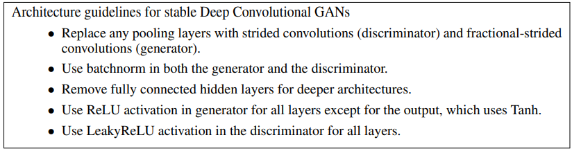
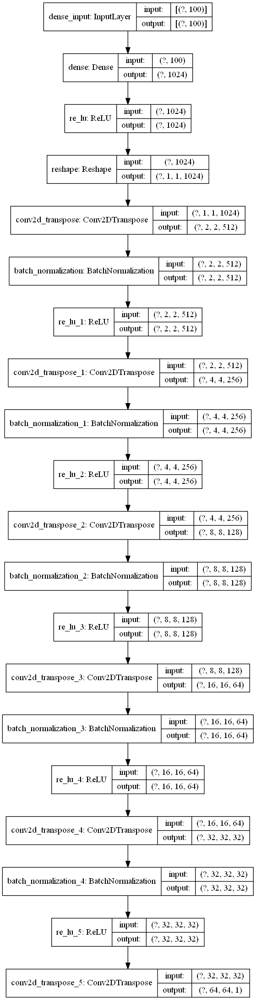
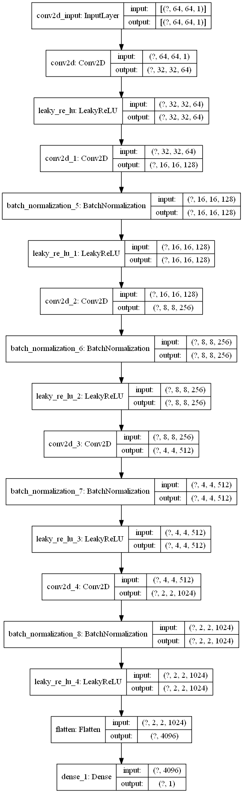
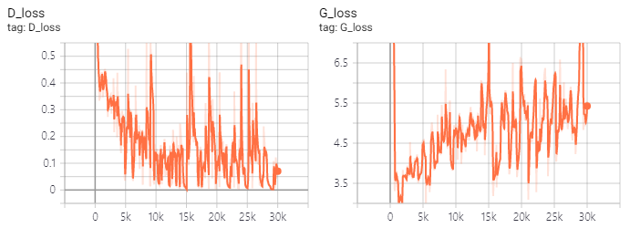
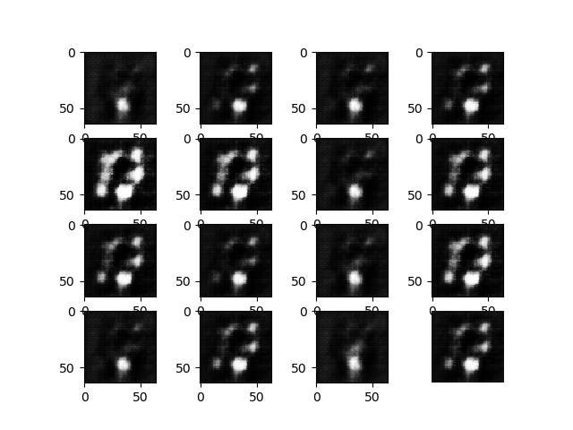
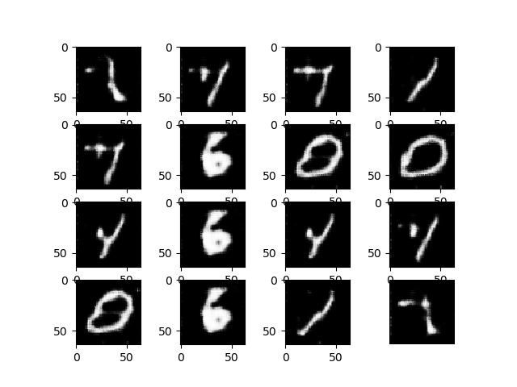
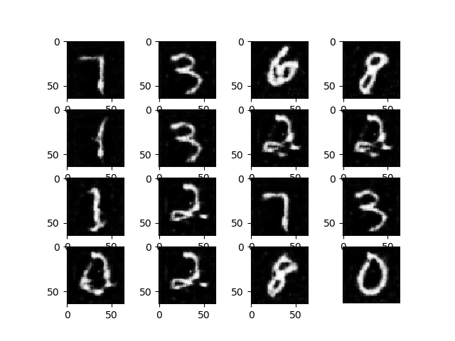
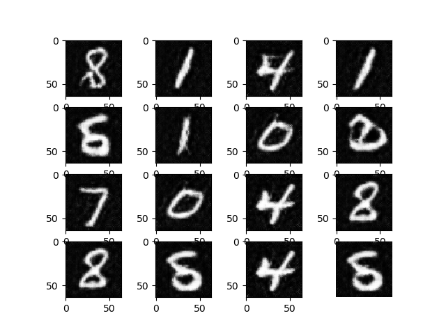

# DCGAN_tensorflow2
An implementation of DCGAN using Tensorflow2.0

<center></center>

---  

## Requirements
- tensorflow 2.0
- python 3
- numpy
- For make GIF & plot
  - glob
  - imageio
  - matplotlib

---

## Model
### DCGAN Guide
<center></center>

* All models were trained with mini-batch stochastic gradient descent (SGD) with a **mini-batch size of 128**. **All weights were initialized from a zero-centered Normal distribution with standard deviation 0.02**. In the **LeakyReLU**, the slope of the leak was set to **0.2** in all models. While previous GAN work has used momentum to accelerate training, we used the **Adam optimizer** (Kingma & Ba, 2014) with tuned hyperparameters. We found the suggested **learning rate** of 0.001, to be too high, using **0.0002** instead. Additionally, we found leaving the **momentum term β1** at the suggested value of 0.9 resulted in training oscillation and instability while reducing it to **0.5** helped stabilize training.

### **Generator**
<center></center>

### **Discriminator**
<center></center>

---

## Documentation
### Download Dataset
MNIST dataset will be downloaded automatically.
```
(train_images, train_labels), (_, _) = tf.keras.datasets.mnist.load_data()
```

### Training GAN
Use `dcgan.py` to train a DCGAN network.

---

## Results
### loss
<center></center>

### epoch = 1
<center></center>

### epoch = 5
<center></center>

### epoch = 20
<center></center>

### epoch = 44
<center></center>

---

## Reference
 [Alec Radford. *Unsupervised Representation Learning with Deep Convolutional Generative Adversarial Networks*, ICLR2016.](https://arxiv.org/pdf/1511.06434.pdf)
